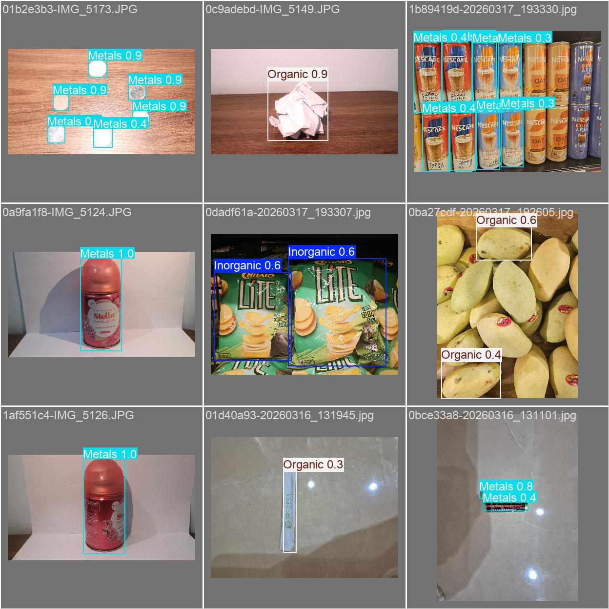

<div align="center">

# Garbot

YOLO-powered waste classification with ESP32 integration.


</div>

---

## Overview

This project was developed as a school presentation to demonstrate how computer vision can assist in automatic waste sorting.

The system uses a custom-trained YOLO model to classify waste into:

- 🥬 Organic
- 🧴 Inorganic
- 🥫 Metal

Once detected, the prediction is sent to an ESP32, which controls the corresponding trash bin.

---

## Demo

<p align="center">

</p>

---

## Features

- Custom YOLO object detection
- Real-time webcam inference
- ESP32 communication
- Custom dataset (~400 labeled images)

---

## Tech Stack

- Python
- Ultralytics YOLO
- PyTorch
- OpenCV
- ESP32

---

## Installation

```bash
git clone https://github.com/lautanteguh/Garbot.git

cd Garbot

pip install -r requirements.txt
```

---

## Usage

Train

```bash
python train.py
```

Predict

```bash
python predict.py
```

---

## Model

The trained model (`YOLOV.pt`) is **not included** in this repository.

Download it from the **Releases** page and place it inside the project root.

---

## Dataset

The model was trained using a custom dataset of approximately **400 labeled images**.

The dataset is not included because of its size.

---

## Future Improvements

- Sends detection results to an ESP32 for automation.
- Better dataset diversity
- Higher accuracy
- Web dashboard
- Mobile support

---
## Acknowledgements

- This project was developed as part of my school's final project.

- Special thanks to my teammates for assisting with image collection and dataset preparation.

- Built using Ultralytics YOLO.
---

## License

MIT License
